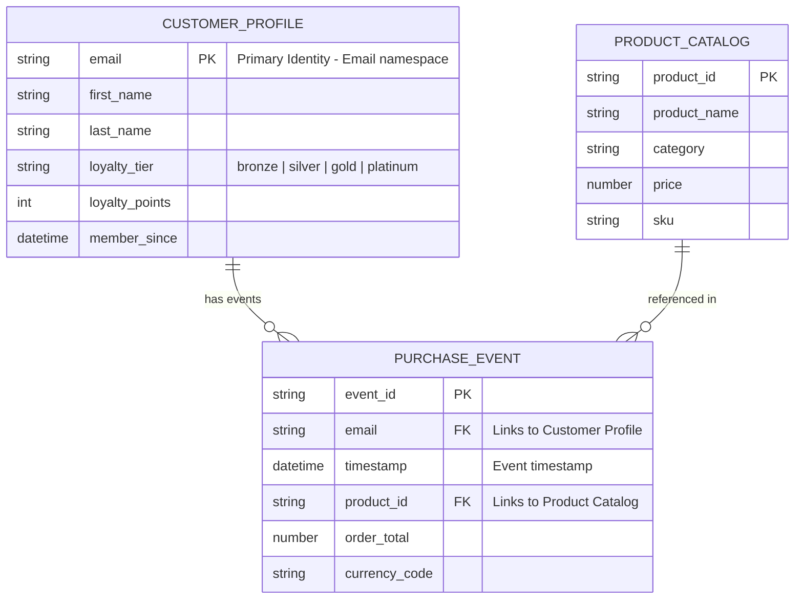

# XDM Schema Design

Load this skill when:

- Designing XDM schemas from data analysis results (Stage 1)
- Deploying schemas to AEP Schema Registry (Stage 2)
- Generating Entity-Relationship Diagrams in Mermaid format (Stage 6)
- Reviewing schema composition or compatibility
- Deciding between standard and custom field groups

Do NOT load this skill for:

- AEP API authentication or general API patterns (use aep-fundamentals)
- Quality scoring methodology (use data-quality-scoring)
- CSV/JSON parsing implementation details

---

## Schema Design Review Protocol (MANDATORY)

Before ANY schema deployment:

1. Save the confirmed schema design mapping to `Matched_SchemaClass & Group/` at project root
2. For each entity, output a JSON file with: class, standard FGs, custom FGs, identity config, field mapping
3. Save combined summary: `schema_design_summary.json`
4. Present the mapping to the user and ASK for confirmation
5. NEVER deploy without explicit user approval

---

## XDM Schema Classes

Every schema MUST be based on exactly one class. The class determines the schema's behavior.

### XDM Individual Profile

- Represents a single person
- Used for: customer/contact profiles (B2C persons, or B2B persons via the b2b-person field groups). For B2B **business accounts**, use `XDM Business Account` instead — see "B2B Edition Schema Architecture"
- Supports Real-Time Customer Profile (union schema)
- Records are merged by identity — same identity = same profile
- Fields represent the current state (last-writer-wins for most fields)
- `$ref`: `https://ns.adobe.com/xdm/context/profile`

### XDM ExperienceEvent

- Represents a time-series event
- Used for: page views, purchases, clicks, form submissions, API calls
- Requires a timestamp field
- Records are appended, never merged — identity links events to profiles
- `$ref`: `https://ns.adobe.com/xdm/context/experienceevent`
- **eventType MUST use standard XDM values** — see table below. Non-standard values display as "Unknown Event" in AEP UI.

#### Standard eventType Values (MANDATORY for field mapping)

When mapping source event fields to `eventType`, ALWAYS use these standard XDM dotted values:

| Category | eventType Value                     | Corresponding Metric Field                   |
| -------- | ----------------------------------- | -------------------------------------------- |
| Web      | `web.webpagedetails.pageViews`      | `web.webPageDetails.pageViews.value: 1`      |
| Web      | `web.webinteraction.linkClicks`     | `web.webInteraction.linkClicks.value: 1`     |
| Commerce | `commerce.productViews`             | `commerce.productViews.value: 1`             |
| Commerce | `commerce.purchases`                | `commerce.purchases.value: 1`                |
| Commerce | `commerce.checkouts`                | `commerce.checkouts.value: 1`                |
| Commerce | `commerce.productListAdds`          | `commerce.productListAdds.value: 1`          |
| Commerce | `commerce.productListRemovals`      | `commerce.productListRemovals.value: 1`      |
| Email    | `directMarketing.emailOpened`       | `directMarketing.emailOpened.value: 1`       |
| Email    | `directMarketing.emailClicked`      | `directMarketing.emailClicked.value: 1`      |
| Email    | `directMarketing.emailBounced`      | `directMarketing.emailBounced.value: 1`      |
| Email    | `directMarketing.emailUnsubscribed` | `directMarketing.emailUnsubscribed.value: 1` |
| Email    | `directMarketing.emailSent`         | `directMarketing.emailSent.value: 1`         |
| Ads      | `advertising.impressions`           | `advertising.impressions.value: 1`           |
| Ads      | `advertising.clicks`                | `advertising.clicks.value: 1`                |

**During Stage 1 field mapping**: When a CSV has an event type column, the mapping file MUST include a transform note showing the source→standard eventType conversion. The data-ingestion agent uses this mapping at Stage 6.

### XDM Record (custom class)

- Generic record with no built-in merge or time-series behavior
- Used for: lookup tables, reference data, configuration records
- Can be linked to Profile or ExperienceEvent schemas via relationship descriptors

### Class Selection Decision Tree

```
Is the data about a person/entity with attributes that change over time?
  YES → Does each record represent the CURRENT state?
    YES → XDM Individual Profile
    NO  → Does each record represent an EVENT with a timestamp?
      YES → XDM ExperienceEvent
      NO  → XDM Record (custom class)
  NO → Is it reference/lookup data?
    YES → XDM Record (custom class)
    NO  → XDM ExperienceEvent (if timestamped) or XDM Record (if not)
```

---

## Field Group Design

Field groups are the primary way to add fields to a schema. They are reusable across schemas of the same class.

### Standard Field Groups (Adobe-provided)

Use standard field groups when they match the data:

- `Demographic Details` — name, birthDate, gender, nationality
- `Personal Contact Details` — email, phone, address
- `Work Contact Details` — work email, work phone, work address
- `Commerce Details` — purchases, cart, product list
- `Web Details` — page views, web interactions, referrer
- `Channel Details` — channel type, content delivery
- `Environment Details` — device, browser, OS
- `ExperienceEvent Implementation Details` — SDK, data source

Always check standard field groups before creating custom ones.

### Custom Field Groups

Create custom field groups when:

- No standard field group covers the data
- Business-specific fields are needed
- The data has domain-specific structure

Naming convention:

- Tenant namespace: `https://ns.adobe.com/{TENANT_ID}/mixins/`
- Title: descriptive, PascalCase (e.g., "Customer Loyalty Details")
- All custom fields live under the tenant namespace: `_{TENANT_ID}.` prefix

### Field Group Structure

```json
{
  "type": "object",
  "title": "Customer Loyalty Details",
  "description": "Custom field group for loyalty program data",
  "meta:intendedToExtend": ["https://ns.adobe.com/xdm/context/profile"],
  "definitions": {
    "loyaltyDetails": {
      "properties": {
        "_{TENANT_ID}": {
          "type": "object",
          "properties": {
            "loyaltyTier": {
              "type": "string",
              "title": "Loyalty Tier",
              "enum": ["bronze", "silver", "gold", "platinum"],
              "description": "Current loyalty program tier"
            },
            "loyaltyPoints": {
              "type": "integer",
              "title": "Loyalty Points",
              "description": "Current loyalty point balance"
            },
            "memberSince": {
              "type": "string",
              "format": "date-time",
              "title": "Member Since",
              "description": "Loyalty program enrollment date"
            }
          }
        }
      }
    }
  },
  "allOf": [{ "$ref": "#/definitions/loyaltyDetails" }]
}
```

### Field Group Rules

- A field group is scoped to one or more classes via `meta:intendedToExtend`
- Do not create a field group that mixes Profile and ExperienceEvent intents
- Keep field groups focused — one domain concept per field group
- Reuse existing field groups across schemas when the same concept appears
- All custom field properties must be nested under `_{TENANT_ID}`

---

## XDM Field Types

| Source Type   | XDM Type  | Format      | Notes                                          |
| ------------- | --------- | ----------- | ---------------------------------------------- |
| String        | `string`  | —           | Default for text fields                        |
| Email         | `string`  | —           | Add identity descriptor for email namespace    |
| URL           | `string`  | `uri`       |                                                |
| Date          | `string`  | `date`      | ISO 8601 date (YYYY-MM-DD)                     |
| DateTime      | `string`  | `date-time` | ISO 8601 datetime                              |
| Integer       | `integer` | —           | Whole numbers                                  |
| Float/Decimal | `number`  | —           | Decimal numbers                                |
| Boolean       | `boolean` | —           |                                                |
| Array         | `array`   | —           | Specify `items` type                           |
| Object        | `object`  | —           | Nested structure with `properties`             |
| Enum          | `string`  | —           | Add `enum` array and `meta:enum` display names |

### Type Mapping From Source Data

When generating schemas from CSV/JSON data analysis:

1. Analyze the detected data types from Stage 0/1
2. Map each source type to the appropriate XDM type
3. Infer format specifiers from data patterns (dates, URLs, emails)
4. Flag ambiguous types for user review (e.g., numeric strings that could be IDs)
5. Preserve source field names in the `title` property, use snake_case for property keys

---

## Identity Configuration

Identity is critical for Profile-enabled schemas. At least one identity descriptor must be present.

### Identity Descriptors

```json
{
  "@type": "xdm:descriptorIdentity",
  "xdm:sourceSchema": "https://ns.adobe.com/{TENANT_ID}/schemas/{SCHEMA_ID}",
  "xdm:sourceVersion": 1,
  "xdm:sourceProperty": "/_{TENANT_ID}/email",
  "xdm:namespace": "Email",
  "xdm:property": "xdm:code",
  "xdm:isPrimary": true
}
```

**CRITICAL**: `xdm:namespace` must be a **string** (namespace code), NOT an object like `{"code": "Email"}`. Using an object causes a 500 deserialization error from the Schema Registry API.

### identityMap Format for Data Ingestion (MANDATORY)

When ingesting data into profile-enabled datasets, every record MUST include `identityMap` with `authenticatedState`:

```json
{
  "identityMap": {
    "Email": [
      {
        "id": "user@example.com",
        "authenticatedState": "ambiguous",
        "primary": true
      }
    ]
  }
}
```

**Without `authenticatedState`**, batch-ingested records may be stored in the data lake but NOT processed into the Real-Time Customer Profile store, causing:

- ExperienceEvents not stitching to profiles
- Identity graph showing only 1 XID instead of linked identities
- Profile `sources` missing datasets that should be contributing

Valid values: `"ambiguous"` (default for batch), `"authenticated"`, `"loggedOut"`.

````

### Common Identity Namespaces

| Namespace | Code | Type | Typical Field |
|-----------|------|------|---------------|
| Email | `Email` | Standard | email address |
| ECID | `ECID` | Standard | Experience Cloud ID |
| Phone | `Phone` | Standard | phone number |
| GAID | `GAID` | Standard | Google Advertising ID |
| IDFA | `IDFA` | Standard | Apple Advertising ID |
| CRM ID | Custom | Custom | internal customer ID |

### Identity Decision Rules

- Every Profile schema MUST have exactly one primary identity
- ExperienceEvent schemas MUST have at least one identity (to link events to profiles)
- Choose the most stable, universally available identifier as primary
- Email is preferred for B2C persons; a custom `CROSS_DEVICE` namespace works for a person keyed by an internal id
- **B2B entities (Account, Opportunity, relations) do NOT follow these rules** — they are keyed on `<entityKey>.sourceKey` under a type-matched namespace. See "B2B Edition Schema Architecture" below and apply it ONLY when the B2B detection gate is met.
- If multiple identities exist, configure them all — AEP Identity Service will link them

---

## Schema Composition Workflow

### MANDATORY Pre-Checks (run BEFORE every schema creation)

**Class Selection Protocol:**
1. Query the Schema Registry for all available standard/default classes
2. Match each data entity to a standard class FIRST
3. NEVER create custom classes without explicitly asking the user
4. If no standard class fits, present the options and ask for guidance

**Field Group Selection Protocol:**
1. Query the Schema Registry for all standard (global) field groups compatible with the chosen class
2. Compare standard FG fields against the source CSV/JSON fields
3. Use standard FGs for every field they cover
4. Create custom FGs ONLY for fields not covered by any standard FG
5. If mapping is ambiguous, ASK the user before proceeding

**Profile Enablement Protocol (USER APPROVAL REQUIRED):**
1. NEVER auto-enable Profile on any schema or dataset during deployment
2. Deploy ALL schemas with Profile DISABLED by default
3. After deployment completes, PRESENT the full list of deployed schemas and ASK the user which ones should be Profile-enabled
4. Only enable Profile AFTER explicit user confirmation with exact schema names
5. When enabling: Schema gets `"meta:immutableTags": ["union"]` via PUT; Dataset gets `"unifiedProfile": ["enabled:true"]` and `"unifiedIdentity": ["enabled:true"]`
6. Both schema AND dataset must be enabled together — one without the other is incomplete
7. **CRITICAL — Granular flag**: After setting unifiedProfile/unifiedIdentity tags via API, you MUST also patch `acp_granular_plugin_validation_flags` from `["identity:enabled", "profile:disabled"]` to `["identity:enabled", "profile:enabled"]`. Without this, the Profile pipeline silently skips processing — data lands in the data lake but never reaches Real-Time Customer Profile. The AEP UI sets this automatically; the API does NOT.
8. If unclear which schemas need Profile, ASK the user

### From Data Analysis to Schema

1. **Review data profiles** from Stage 0 (CSV) and Stage 1 (JSON)
   - Field names, inferred types, sample values, cardinality
   - Null rates, distinct value counts, pattern distributions

2. **Determine schema class** using the Class Selection Decision Tree
   - Run the Class Selection Protocol above — query standard classes first

3. **Identify standard field groups** that match source fields
   - Run the Field Group Selection Protocol above — query standard FGs first
   - Map source fields to standard field group fields
   - Track unmapped fields

4. **Design custom field groups** for unmapped fields only
   - Group related fields into logical field groups
   - Use the project's domain context for naming

5. **Configure identity descriptors**
   - Identify identity candidate fields (email, phone, customer ID)
   - Select primary identity
   - Configure additional identity descriptors

6. **Compose the schema**
   - Combine class + standard field groups + custom field groups
   - Set title, description, and metadata
   - Deploy with Profile DISABLED — Profile enablement is a separate post-deployment step requiring user approval

7. **Validate composition**
   - All fields present in the composition
   - No class/field-group compatibility conflicts
   - Identity descriptors reference valid fields
   - Required fields have source data coverage (from quality analysis)

8. **Post-deployment: Ask user about Profile enablement**
   - Present all deployed schemas and ask which should be Profile-enabled
   - Only enable after explicit user confirmation

---

## Schema Deployment

### Pre-Deployment Checklist

- Schema composition is valid (class + field groups)
- All referenced field groups exist in the target sandbox
- If field groups are new, deploy field groups before the schema
- Identity descriptors are prepared
- Dataset configuration is ready (name, description, profile-enabling tags)

### Deployment Order

1. Deploy custom data types (if any)
2. Deploy custom field groups
3. Deploy schema (referencing field groups)
4. Apply identity descriptors
5. Enable schema for Profile (if applicable)
6. Create dataset linked to schema (Stage 4)

### Post-Deployment Validation

- GET the deployed schema and verify all field groups are resolved
- Verify identity descriptors are applied
- Verify Profile enabling status
- Test with a small sample ingestion batch

---

## Schema Compatibility and Evolution

### Non-Breaking Changes (allowed on schemas with datasets)
- Adding optional fields to existing field groups
- Adding new field groups to the schema
- Adding new identity descriptors
- Updating titles and descriptions

### Breaking Changes (blocked on schemas with datasets)
- Removing fields
- Changing field data types
- Removing field groups
- Changing the schema class
- Changing a field from optional to required

### Evolution Strategy
- Design schemas with extension in mind — prefer optional fields
- Use separate field groups for different feature phases
- Version field groups by including a version indicator in the title when major changes are needed
- Create new schemas (not modify existing) when breaking changes are required

---

## Mermaid ERD Generation (Stage 6)

### ERD Purpose

Entity-Relationship Diagrams visualize the relationships between XDM schemas, field groups, and datasets in the AEP implementation.

### Mermaid ERD Syntax



### ERD Generation Rules

1. **One entity per schema** — each XDM schema becomes an entity in the ERD
2. **Fields from all field groups** appear as attributes in the entity
3. **Primary identity** is marked as PK
4. **Foreign keys / identity links** are marked as FK with the target entity noted
5. **Relationships** are derived from:
   - Shared identity namespaces (same identity in multiple schemas)
   - Relationship descriptors defined between schemas
   - Foreign key patterns in the data
6. **Cardinality notation**:
   - `||--||` : one to one
   - `||--o{` : one to many
   - `}o--o{` : many to many (rare in XDM, use a junction schema)
7. **Comments** in quotes describe constraints, enums, or identity namespace

### ERD Content Layers

Generate ERDs at multiple levels of detail:

**Level 1 — Schema Overview**

- Shows only schema names and relationships
- Best for architecture presentations

**Level 2 — Key Fields**

- Shows identity fields, foreign keys, and critical business fields
- Best for design reviews

**Level 3 — Full Detail**

- Shows all fields with types
- Best for implementation reference

### ERD File Output

- Output file: `output/erd_{schema_group_name}.md` containing the Mermaid code block
- One ERD per logical schema group (e.g., all schemas related to a customer journey)
- Optionally one master ERD showing all schemas if the total is manageable (< 10 schemas)

---

## Schema Design Anti-Patterns

- MUST NOT create one massive field group with all fields — split by domain concept
- MUST NOT duplicate fields across multiple field groups
- MUST NOT use generic field names (e.g., `field1`, `data`, `value`) — use descriptive names
- MUST NOT mix Profile and ExperienceEvent fields in one custom field group
- MUST NOT hardcode tenant IDs in schema templates — use configuration
- MUST NOT skip identity configuration for Profile-enabled schemas
- MUST NOT deploy schemas without validating field group compatibility first
- MUST NOT generate ERDs without reflecting the actual deployed schema state

---

## B2B Edition Schema Architecture

### WHEN TO APPLY — B2B Detection Gate (READ FIRST)

Apply this section ONLY when the use case is genuinely B2B. For standard B2C / Individual-Profile
projects, do NOT apply any rule below — use the standard pattern (person = `XDM Individual Profile`,
identity = Email/Phone/ECID or a custom `CROSS_DEVICE` namespace via `identityMap`, per the Identity
Configuration section above).

Classify by the **DATA**, not the sandbox. A use case is B2B when ANY of these hold:

- The data models business **Accounts**, **Opportunities**, **Campaigns**, **Marketing Lists**, or
  **Account↔Person relations** as first-class entities
- Entities map to B2B XDM classes (`XDM Business Account`, `XDM Business Person`,
  `XDM Business Account Person Relation`, `XDM Business Opportunity`, etc.)
- The requirement explicitly calls for account-based marketing (ABM), lead-to-account matching, or account 360

**Being in a B2B-Edition sandbox is NOT, by itself, a trigger.** B2B Edition is a *prerequisite* that
*enables* the B2B classes — it does not make every project B2B. A plain B2C dataset (persons + events, no
account/opportunity/relation entities) ingested into a B2B-Edition sandbox is STILL B2C: model it as
`XDM Individual Profile` + `XDM ExperienceEvent` with `identityMap`. Do not push B2C data into the
`sourceKey`/`b2b_*` model just because the sandbox supports B2B.

If none of the DATA signals above hold → it is B2C/standard. STOP — do not apply the rules below.

> A person/contact entity by itself is NOT automatically B2B. A contact modelled as
> `XDM Individual Profile` keyed by Email + a custom `CROSS_DEVICE` namespace is a valid standard
> pattern and works without any B2B rule. B2B rules are required specifically for **Account**,
> **Opportunity**, and their **relation** entities.

### ALWAYS USE ADOBE OOTB CLASSES AND STANDARD NAMESPACES (B2B)

For a B2B model, ALWAYS use Adobe's out-of-the-box (OOTB) standard B2B classes and the standard `b2b_*`
identity namespaces. Do NOT create custom classes or custom identity namespace codes for the core B2B
entities — that is what the account union, relationship descriptors, and downstream B2B features
(segmentation, lead-to-account matching, AJO) expect.

- **Classes** — use the standard B2B classes verbatim: `XDM Business Account`
  (`.../xdm/context/account`), `XDM Business Person` (Individual Profile class + the OOTB
  `b2b-person-details` / `b2b-person-components` field groups), `XDM Business Account Person Relation`
  (`.../xdm/classes/account-person`), `XDM Business Opportunity`, etc. NEVER invent a custom class for an
  account/person/opportunity/relation.
- **Namespaces** — use the standard codes and their fixed idTypes: `b2b_account` (`B2B_ACCOUNT`),
  `b2b_person` (`CROSS_DEVICE`), `b2b_account_person_relation` (`B2B_ACCOUNT_PERSON`), … (see the table
  below). NEVER create a custom-coded namespace (e.g. `ClientAccountID`) to key a B2B core entity.
- **Custom field groups are still allowed for business-specific ATTRIBUTES** that extend an OOTB class
  (e.g. client-specific account operational fields), as long as the class and the identity namespaces remain
  Adobe-standard. Custom FGs add columns; they never replace the class or the identity model.
- Fastest correct path: run Adobe's B2B "Namespaces and Schemas Auto-generation Utility" (see
  `aep-fundamentals`) to create all standard B2B namespaces and schemas, then attach custom attribute
  field groups.

### THE CORE B2B IDENTITY RULE

Every B2B entity is keyed on **`<entityKey>.sourceKey`** — a composite string held in a **B2B Source**
data-type field on the base class — under a namespace whose **idType matches the entity type**.

B2B entities are NOT keyed by a scalar id and NOT by a `CROSS_DEVICE` custom namespace in `identityMap`.
A `CROSS_DEVICE` `identityMap` entry CANNOT place a record in the Business Account (or any B2B) union —
it only affects the Person/Profile union. This is the single most common B2B mistake.

### B2B classes, keys, and namespaces

| Entity                    | XDM Class ref                                    | Primary identity field                | Namespace code                     | Namespace idType         |
| ------------------------- | ------------------------------------------------ | ------------------------------------- | ---------------------------------- | ------------------------ |
| Business Account          | `https://ns.adobe.com/xdm/context/account`       | `/accountKey/sourceKey`               | `b2b_account`                      | **`B2B_ACCOUNT`**        |
| Business Person           | `https://ns.adobe.com/xdm/context/profile` + `b2b-person-details` + `b2b-person-components` FGs | `/b2b/personKey/sourceKey` | `b2b_person`     | `CROSS_DEVICE`           |
| Account-Person Relation   | `https://ns.adobe.com/xdm/classes/account-person`| `/accountPersonKey/sourceKey`         | `b2b_account_person_relation`      | **`B2B_ACCOUNT_PERSON`** |
| Business Opportunity      | `https://ns.adobe.com/xdm/classes/opportunity`   | `/opportunityKey/sourceKey`           | `b2b_opportunity`                  | `B2B_OPPORTUNITY`        |
| Opportunity-Person Rel.   | opportunity-person relation class                | `/opportunityPersonKey/sourceKey`     | `b2b_opportunity_person_relation`  | `B2B_OPPORTUNITY_PERSON` |
| Campaign / Member         | campaign classes                                 | `<key>.sourceKey`                     | `b2b_campaign` / `b2b_campaign_member` | `B2B_CAMPAIGN` / `B2B_CAMPAIGN_MEMBER` |
| Marketing List / Member   | marketing-list classes                           | `<key>.sourceKey`                     | `b2b_marketing_list` / `b2b_marketing_list_member` | `B2B_MARKETING_LIST` / `B2B_MARKETING_LIST_MEMBER` |

Namespace codes/idTypes above match Adobe's B2B auto-generation utility. Custom display names are
allowed, but the **idType MUST match the entity type** — an account namespace is ALWAYS `B2B_ACCOUNT`,
never `CROSS_DEVICE`. (Namespace creation payloads live in `aep-fundamentals`.)

### B2B Source key structure

Each `*Key` field (`accountKey`, `personKey`, `accountPersonKey`, …) is the **B2B Source** data type:

- `sourceKey` — the composite unique id; **THIS is the identity**. Must be non-null.
- `sourceID` — the record's id in the source system
- `sourceInstanceID` — the source instance / org id
- `sourceType` — the source system name

Adobe composes `sourceKey` as `[sourceID]@[sourceInstanceID].[sourceType]`. Example account:

```json
"accountKey": {
  "sourceKey": "ACCT-001@ClientSystem.SRC",
  "sourceID": "ACCT-001",
  "sourceInstanceID": "ClientSystem",
  "sourceType": "SRC"
}
```

Only `sourceKey` is required for keying; populate all four for completeness.

### Identity descriptor (exact payload — note `xdm:property` is `xdm:code`)

Business Account primary identity:

```json
{
  "@type": "xdm:descriptorIdentity",
  "xdm:sourceSchema": "<account schema $id>",
  "xdm:sourceVersion": 1,
  "xdm:sourceProperty": "/accountKey/sourceKey",
  "xdm:namespace": "b2b_account",
  "xdm:property": "xdm:code",
  "xdm:isPrimary": true
}
```

Same shape for Person (`/b2b/personKey/sourceKey` → `b2b_person`) and Relation
(`/accountPersonKey/sourceKey` → `b2b_account_person_relation`). Each B2B schema also gets a **secondary**
identity on `/extSourceSystemAudit/externalKey/sourceKey` (same namespace, `isPrimary: false`); Person
adds a secondary **Email** identity on `/workEmail/address`.

### Relationship descriptors (schema-level linking, NOT identity stitching)

Account↔Person is a relationship descriptor, not an identity merge. Never merge two entity types into
one identity-graph node:

```json
{
  "@type": "xdm:descriptorRelationship",
  "xdm:sourceSchema": "<B2B Person schema $id>",
  "xdm:sourceVersion": 1,
  "xdm:sourceProperty": "/personComponents[*]/sourceAccountKey/sourceKey",
  "xdm:destinationSchema": "<B2B Account schema $id>",
  "xdm:destinationVersion": 1,
  "xdm:destinationProperty": "/accountKey/sourceKey",
  "xdm:destinationNamespace": "b2b_account",
  "xdm:sourceToDestinationTitle": "Account",
  "xdm:destinationToSourceTitle": "People",
  "xdm:cardinality": "M:1"
}
```

The Account-Person Relation schema carries TWO relationship descriptors — `/accountKey/sourceKey` →
`b2b_account` and `/personKey/sourceKey` → `b2b_person` — while its own primary identity is
`/accountPersonKey/sourceKey`.

### Secondary identities (standard — Adobe's B2B utility adds these)

Every B2B entity gets a SECONDARY identity on `/extSourceSystemAudit/externalKey/sourceKey` in its OWN
namespace (`isPrimary:false`), for source-system reconciliation. Same `xdm:descriptorIdentity` payload as
the primary but `isPrimary:false`:

```json
{ "@type": "xdm:descriptorIdentity", "xdm:sourceSchema": "<schema $id>", "xdm:sourceVersion": 1,
  "xdm:sourceProperty": "/extSourceSystemAudit/externalKey/sourceKey",
  "xdm:namespace": "b2b_account", "xdm:property": "xdm:code", "xdm:isPrimary": false }
```

Account → `b2b_account`, Person → `b2b_person` (+ the `/workEmail/address` → `Email` secondary), Relation
→ `b2b_account_person_relation`. `extSourceSystemAudit` is present on the Business Account class and the
b2b-person field groups.

### Account parent-hierarchy (apply ONLY when accounts have a parent hierarchy)

If the source data has parent-account references, model the hierarchy with TWO descriptors on the account's
`/accountParentKey/sourceKey` field (this field comes from the OOTB Business Account field group — the bare
class does NOT include it, so add that field group if you need hierarchy):

- **Reference identity** — marks the parent key as pointing at a `b2b_account` identity:
  ```json
  { "@type": "xdm:descriptorReferenceIdentity", "xdm:sourceSchema": "<account $id>",
    "xdm:sourceVersion": 1, "xdm:sourceProperty": "/accountParentKey/sourceKey",
    "xdm:identityNamespace": "b2b_account" }
  ```
- **Legacy one-to-one relationship** — links child account → parent account (self-referential):
  ```json
  { "@type": "xdm:descriptorOneToOne", "xdm:sourceSchema": "<account $id>", "xdm:sourceVersion": 1,
    "xdm:sourceProperty": "/accountParentKey/sourceKey",
    "xdm:destinationSchema": "<account $id>", "xdm:destinationVersion": 1,
    "xdm:destinationProperty": "/accountKey/sourceKey" }
  ```

Skip this when accounts are flat (no parent-account data) — do not add an unused `accountParentKey` field
just to match the utility.

### The four B2B descriptor types (full set)

| Descriptor `@type` | Purpose | Example |
| --- | --- | --- |
| `xdm:descriptorIdentity` | Primary/secondary identity on a `sourceKey` field | `/accountKey/sourceKey` → `b2b_account` |
| `xdm:descriptorRelationship` | Cross-entity link (M:1) between two schemas | Person `personComponents[*].sourceAccountKey.sourceKey` → Account |
| `xdm:descriptorReferenceIdentity` | Marks a field as a reference to another entity's identity namespace | `/accountParentKey/sourceKey` → `b2b_account` |
| `xdm:descriptorOneToOne` | Legacy 1:1 relationship (e.g. account→parent account) | `/accountParentKey/sourceKey` → `/accountKey/sourceKey` |

### Data population at ingestion (for the data-ingestion agent)

For B2B entities, populate the `*Key` object (especially `sourceKey`). Do NOT rely on `identityMap`
alone to key a B2B entity. `identityMap` MAY be added for convenience but is not what keys the entity.

### FORBIDDEN in B2B

- Keying a Business Account via a scalar `accountID`, or via `identityMap` in a `CROSS_DEVICE`
  namespace → the account will NOT materialize in the `_xdm.context.account` union.
- Using idType `CROSS_DEVICE` for an account / opportunity / relation namespace.
- Adding the Account namespace to a Person's `identityMap` to "link" them — use a relationship
  descriptor instead.

### Common failure signature

Business Account returns 404 in the `_xdm.context.account` union despite batch `success` and a
Profile-enabled dataset → the account has no primary identity on `accountKey.sourceKey` in a
`B2B_ACCOUNT` namespace. Fix: add the descriptor, populate `accountKey.sourceKey`, re-ingest.
````
